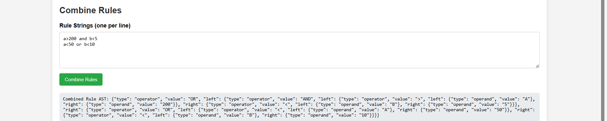

# Rule Engine with Abstract Syntax Tree (AST)

## Table of Contents
1. [Objective](#objective)
2. [Data Structure](#data-structure)
   - [Node Structure](#node-structure)
   - [AST Representation Example](#ast-representation-example)
3. [Data Storage](#data-storage)
   - [Sample Database Entry for Combined Rules](#sample-database-entry-for-combined-rules)
   - [Explanation of Fields](#explanation-of-fields)
4. [Database Schema Visual](#database-schema-visual)
5. [Key Points for Evaluation](#key-points-for-evaluation)
   - [Example User Data](#example-user-data)
   - [Evaluation Instructions](#evaluation-instructions)
6. [Sample Rules](#sample-rules)
7. [API Design](#api-design)
   - [`create_rule(rule_string):`](#create_rulerulestring)
   - [`combine_rules(rules):`](#combine_rulesrules)
   - [`evaluate_rule(user_data):`](#evaluate_ruleuser_data)
8. [Requirements](#requirements)
9. [Conclusion](#conclusion)

## Objective
Develop a 3-tier rule engine application with a simple UI, API, and backend. This application determines user eligibility based on attributes like age, department, income, and spending. The system uses an Abstract Syntax Tree (AST) for conditional rule representation, allowing dynamic creation, combination, and modification of rules.

> **Note:** Before running the application, create a `.env` file in the root directory to store your MongoDB URI. The format should be:
>
> ```plaintext
> MONGODB_URI=<your_mongodb_uri>
> ```
>
> Make sure to replace `<your_mongodb_uri>` with your actual MongoDB connection string. The application will automatically load this value using the `python-dotenv` library when initializing the database connection.

## Data Structure

The AST is represented using a node-based system.

### Node Structure
```python
class Node:
    def __init__(self, type: str, value: str = None, left: 'Node' = None, right: 'Node' = None):
        self.type = type  # "operator" for AND/OR, "operand" for conditions
        self.value = value  # Optional value for operand nodes
        self.left = left  # Reference to the left child
        self.right = right  # Reference to the right child
```

### AST Representation Example
The rule `((age > 30 AND department = 'Sales') OR (age < 25 AND department = 'Marketing')) AND (salary > 50000 OR experience > 5)` can be structured as:

```json
{
    "type": "operator",
    "value": "AND",
    "left": {
        "type": "operator",
        "value": "OR",
        "left": {
            "type": "operator",
            "value": "AND",
            "left": {
                "type": "operator",
                "value": ">",
                "left": {"type": "operand", "value": "AGE"},
                "right": {"type": "operand", "value": "30"}
            },
            "right": {
                "type": "operator",
                "value": "<",
                "left": {"type": "operand", "value": "AGE"},
                "right": {"type": "operand", "value": "25"}
            }
        },
        "right": {
            "type": "operator",
            "value": ">",
            "left": {"type": "operand", "value": "SALARY"},
            "right": {"type": "operand", "value": "50000"}
        }
    },
    "right": {
        "type": "operator",
        "value": ">",
        "left": {"type": "operand", "value": "EXPERIENCE"},
        "right": {"type": "operand", "value": "5"}
    }
}
```

## Data Storage
**Database:** MongoDB (via PyMongo).  
**Schema:** Stores individual rules, combined rules, and metadata.

### Sample Database Entry for Combined Rules
Combined rules are stored in MongoDB with the following structure:

```json
{
    "_id": "671bfb7f11e466923b7aa118",
    "combined_rule": "{\"type\": \"operator\", \"value\": \"AND\", \"left\": {\"type\": \"operator\", \"value\": \"OR\", \"left\": ...}}"
}
```

### Explanation of Fields
- `_id`: Unique identifier for each combined rule (auto-generated by MongoDB).
- `combined_rule`: A JSON string representation of the combined AST.

## Database Schema Visual


## Key Points for Evaluation
**Quoting Requirement:** During evaluation, all keys and values in the user data dictionary must be in uppercase and enclosed in double quotes, including numeric values. This simplifies parsing and ensures consistency.

### Example User Data:

```json
{
    "AGE": "35",
    "DEPARTMENT": "SALES",
    "SALARY": "60000",
    "EXPERIENCE": "3"
}
```

### Evaluation Instructions
To evaluate a user against a rule, you can copy and paste a rule created using the `create_rule` API. Ensure that the user data is formatted as shown in the example above.

## Sample Rules
### Rule 1:
```plaintext
((age > 30 AND department = 'Sales') OR (age < 25 AND department = 'Marketing')) AND (salary > 50000 OR experience > 5)
```
### Rule 2:
```plaintext
((age > 30 AND department = 'Marketing')) AND (salary > 20000 OR experience > 5)
```

## API Design
### `create_rule(rule_string):`
**Description:** Takes a rule string as input and returns a Node object representing the AST.  
**Visual Representation:** 

### `combine_rules(rules):`
**Description:** Accepts a list of rule strings, combines them into a single AST, and returns the root node of the combined AST.  
**Visual Representation:** 

### `evaluate_rule(user_data):`
**Description:** Accepts a JSON object containing the combined rule's AST and a dictionary representing user data in the required format. Returns True if the user matches the criteria, otherwise False.  
**Visual Representation:** 

## Requirements
Install the following dependencies listed in requirements.txt:

```plaintext
pymongo==4.3.3
python-dotenv==1.0.0
Flask==2.3.1
Flask-PyMongo==2.3.0
```

## Conclusion
This rule engine application allows flexible and dynamic eligibility evaluation using AST-based rules, simplifying the process of creating, combining, and modifying rules. Designed for scalability, it adheres to best practices in data structure, storage, and API design.
